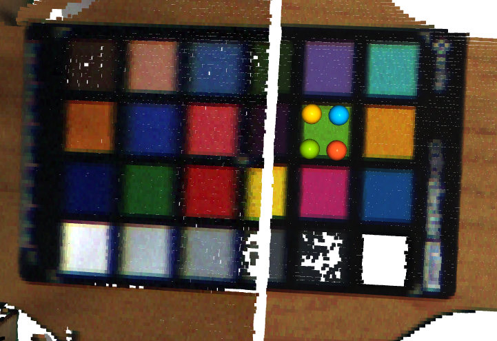
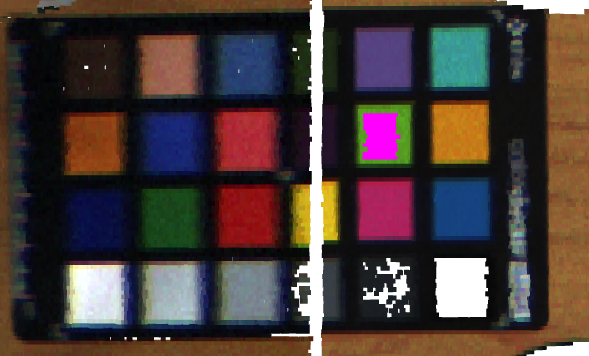
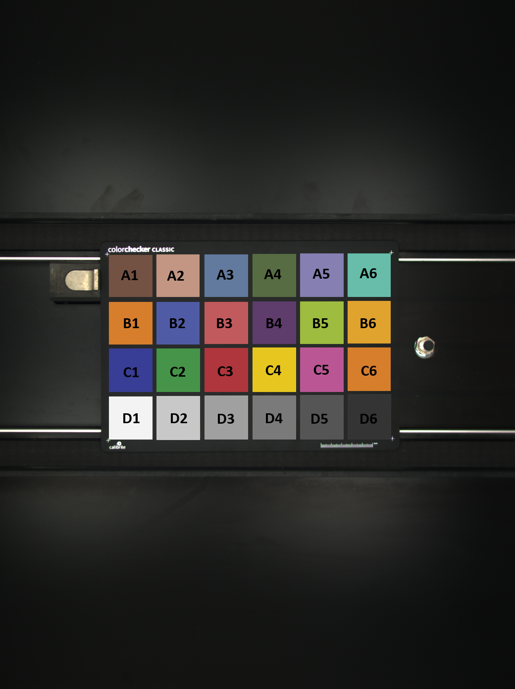

# 3D color checker
Some 3D scanners save RGB values for each point. 
To check the color values of the scanners a colorcheker can be used.
However, default color checker detection and extraction scripts won't work.
This repository offers a solution in the form of a 3D colorchecker detection method. It consist of multiple steps.
First, the user is asked to mark the corners of the pointcloud squares using `python_point_picker.py`.
The second step consist of performing the actual check, described in section 2.

## Extracting the colors
Script: `python_point_picker.py` is used to manually extract the color values of the points into CSV's.

After marking the corners of the first square the pointcloud looks like this:

By pressing 'q' it process the location, printing the id's and locations of all four points:
- *point_ids*: [87835, 87120, 65529, 66207]
- *coordinates*:  [[-268.0008850097656, 331.1571044921875, 800.7398681640625], [-295.6825256347656, 329.8944091796875, 810.8343505859375], [-294.297607421875, 290.7018737792969, 810.375244140625], [-266.7452697753906, 291.9632568359375, 800.510498046875]]

Assuming the color checker is flat and the scanner cannot look through objects we can use the x,y coorinates to select all the points in the square. The color values of the points inside this square are saved to a csv file and an image is rendered in which the selected points are marked in pink:

It helps to think about the file names in advance. 
Extracting the data is a labor intensive process. Luckily it enables use to automate the following steps.

It is recommended to name the csv's to the squares, being 'D6.csv', for the order see: 

## Color correction
There are various ways to do, depending on the type of colorchecker and final implementation.
We used two approaches, the first is fitting a polynomial through the ground truth colors of the chart and the scanners values and computing the color difference in the CIE color space. as done in: 
[color_correction.py](https://github.com/JTvD/arcu_colorchecker/blob/main/color_correction.py)

Another approach we used is to take a normal RGB image of the color checker and overwrite the values in the squares with the color values extracted in the previous step. The resulting image can than be analysed like any other color checker.
For example the matlab calbrite colorchart detector [matlab color checker](https://nl.mathworks.com/help/images/ref/colorchecker.html) orr the [python color chart checker package](https://github.com/colour-science/colour-checker-detection).
The script `create_fake_colorchart.py` shows how to to do this, note that it also infers the color for the black square as this is to dark for our scanner. 

